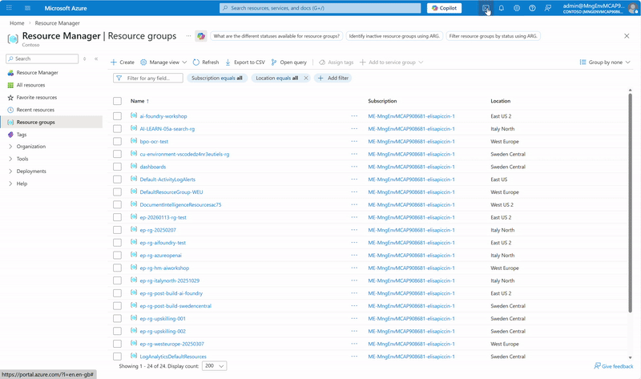
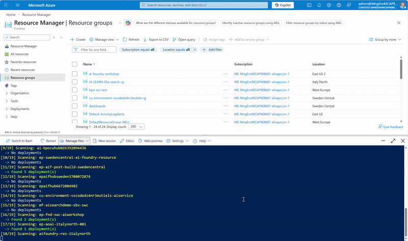

# Azure AI Deployments Scanner

[](https://github.com/PowerShell/PowerShell)
[](https://docs.microsoft.com/en-us/cli/azure/)
[](https://opensource.org/licenses/MIT)
[-blue.svg)](https://shell.azure.com)

> **⚠️ IMPORTANT DISCLAIMER**
> 
> This script is **NOT an official Microsoft solution** and is **not supported** under any Microsoft support program. It is provided **AS IS without warranty** under the MIT License. Use at your own risk - the authors disclaim all liability for any damages arising from its use.

A PowerShell script to scan and inventory all model deployments across your Foundry resources.

🔍 This tool automates the retrieval of model deployment information across Foundry resources and projects, providing visibility into deployments that are not available through Azure Resource Graph queries.

## Quick Start (Azure Cloud Shell - Recommended)

1. **Download script** from [Get-AzureAIDeployments.ps1](https://github.com/elisapiccin/azure-ai-deployment-scanner/blob/main/Get-AzureAIDeployments.ps1)
2. **Start Azure Cloud Shell** from the Azure portal
3. **Switch to PowerShell**: `pwsh` (if currently in bash)
4. **Upload the script** you downloaded in step 1
5. **Run the script**: `./Get-AzureAIDeployments.ps1` (shows all deployments by default)
6. **Download results**: copy/paste the output file name and download the Excel file from Cloud Shell

## TLDR - Action time
> **🚀 Run Azure AI Deployment Scanner**
> 
> 
> 
> **📄 Download your output**
> 
> 

## Default Behavior

**When run without parameters**, the script:
- Scans **all accessible subscriptions** in your Azure tenant
- Shows **all deployments** (no filtering)
- Outputs results in **Excel format** (with auto-formatting)
- Saves results with timestamp: `deployments-results-YYYYMMDD-HHMMSS.xlsx`

## Azure Cloud Shell (Recommended)

**Prerequisites:**
- **Azure Account** with active subscription
- **Reader permissions** on target subscription(s) - sufficient for scanning deployments
- **PowerShell mode** in Cloud Shell (`pwsh` command to switch from bash)

**Benefits:**
- **No installation required** - Azure CLI and PowerShell are pre-installed
- **Always authenticated** - Uses your current Azure session
- **Latest tools** - Always up-to-date Azure CLI version
- **Cross-platform** - Works from any browser
- **Secure** - No need to store credentials locally

**Workflow:**
1. **Open Azure Cloud Shell**
2. **Switch to PowerShell** (if in bash): `pwsh`
3. **Upload the script** using the upload button or drag-and-drop
5. **Run the script**: `./Get-AzureAIDeployments.ps1` (scans all subscriptions by default)
6. **Download results**: Use Cloud Shell download button to get the Excel file


## Usage Examples

```powershell
# Show help
./Get-AzureAIDeployments.ps1 -Help

# Default: scan all deployments across all accessible subscriptions (Excel output)
./Get-AzureAIDeployments.ps1

# Explicit all deployments scan
./Get-AzureAIDeployments.ps1 -All

# Find only GPT-4o deployments
./Get-AzureAIDeployments.ps1 -ModelFilter "gpt-4o"

# Scan current subscription only
./Get-AzureAIDeployments.ps1 -CurrentSubscriptionOnly

# Scan specific subscription
./Get-AzureAIDeployments.ps1 -SubscriptionId "your-subscription-id"

# Output to CSV format instead of Excel
./Get-AzureAIDeployments.ps1 -OutputFormat CSV

# Find GPT models in current subscription with Excel output
./Get-AzureAIDeployments.ps1 -ModelFilter "gpt" -CurrentSubscriptionOnly
```

## Output

The script provides:

- **On-screen results** with color-coded progress, status and summary statistics showing model and resource group distribution
- **Excel export** with timestamp (`deployments-results-YYYYMMDD-HHMMSS.xlsx`) 
  - Auto-formatted with filters, frozen headers, and table styling
  - Ready for analysis and sharing
- **(Optionally) CSV export** available with `-OutputFormat CSV` parameter

### Output Columns

| Column | Description |
|--------|-------------|
| SubscriptionId | Azure subscription ID |
| SubscriptionName | Azure subscription display name |
| ResourceGroup | Resource group name |
| Resource | Azure resource name |
| Deployment | Deployment name |
| Model | Model name (e.g., gpt-4o, gpt-4o-mini) |
| Version | Model version (e.g 2024-11-20)|
| Status | Deployment status |
| Sku | Deplyment type (e.g. DataZoneStandard) |
| Capacity | Allocated capacity |
| Endpoint | Service endpoint URL |
| Location | Model provider (e.g. OpenAI) |
| CreatedDate | When deployment was created |
| VersionUpgradeOption | Version upgrade policy (e.g., OnceNewDefaultVersionAvailable) |

> **Note**: Model retirement dates are not currently available through the Azure CLI API. Check the [Microsoft Foundry model deprecation and retirements documentation](https://learn.microsoft.com/en-us/azure/ai-foundry/openai/concepts/model-retirements) for the latest retirement announcements.

## Troubleshooting

For detailed troubleshooting guidance, see [TROUBLESHOOTING.md](TROUBLESHOOTING.md).

## What's Scanned

The script finds deployments in:
- All **Foundry resources** 
- All resource groups in the specified subscription(s)
- All model types: GPT, Codex, DALL-E, Whisper, text-embedding, etc.

## Security & Permissions

### Required Permissions
The script only needs **Reader permissions** on the target subscription(s):
- `Microsoft.CognitiveServices/accounts/read`
- `Microsoft.CognitiveServices/accounts/deployments/read`

**Reader role** at subscription level is sufficient for full functionality.

### Security Notes
- **Azure Cloud Shell**: Uses your current Azure session automatically
- **No sensitive data storage**: Results contain deployment metadata only
- **Read-only operations**: Script never modifies Azure resources

## Local Execution (Not recommended)

For users who prefer to run the script locally, the following prerequisites are needed.
The script will check these for you automatically:

- **Azure CLI** - Install from: https://aka.ms/installazurecliwindows
  - **Minimum version**: Azure CLI 2.37.0+ (for cognitive services commands)
- **PowerShell** - Windows PowerShell 5.1+ or PowerShell 7+
  - **Note**: PowerShell 7+ recommended for better JSON handling
- **Azure Login** - Run: `az login`
- **Permissions** - Reader access to Azure OpenAI/AI Services resources

## Support

For issues or questions:
1. Verify Azure CLI and login status
2. Check the [troubleshooting section](TROUBLESHOOTING.md) above

## ⭐ Show Your Support

If this tool helped you manage your Azure AI deployments, please give it a star! ⭐

---

**Version**: 1.0  
**Recommended Platform**: Azure Cloud Shell (PowerShell mode)  
**Compatibility**: PowerShell 5.1+ (PowerShell 7+ recommended), Windows/Linux/macOS (with PowerShell Core)  
**Dependencies**: Azure CLI 2.37.0+ (pre-installed in Cloud Shell)  
**Default Output**: Excel format with auto-formatting and filters